# 🩺 Skin Lesion Segmentation & Classification  

Deep learning project for **automated skin lesion analysis** – including **segmentation** (FCN, UNet) and **classification** (CNN into 7 categories).  
I trained & fine-tuned models on benchmark medical datasets to achieve strong performance on both tasks.  

---

## 📊 Datasets Used
- **[PH² Database](https://www.fc.up.pt/addi/ph2%20database.html)** – 200 dermoscopic images (segmentation)  
- **[HAM10000](https://www.kaggle.com/kmader/skin-cancer-mnist-ham10000)** – 10,015 images (classification)  

Example samples:  

  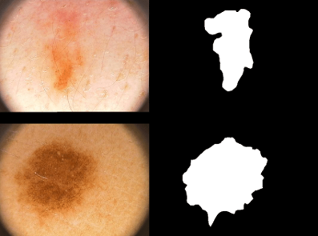
  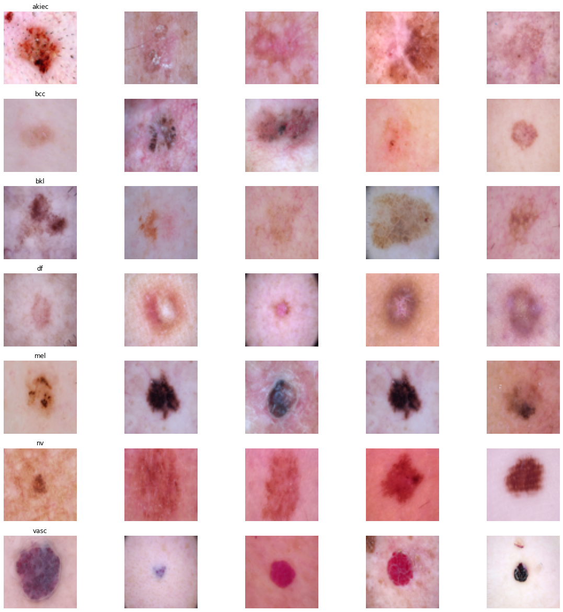

---

## 🧠 Models

### 🔹 Segmentation
1. **Fully Convolutional Network (FCN)**  
   

     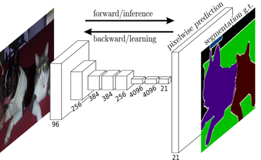
   
  

2. **U-Net**  
   

     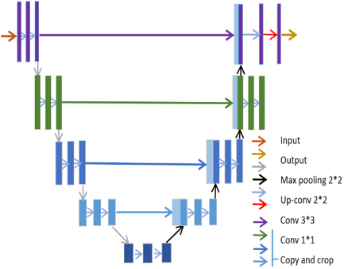
   
  

### 🔹 Classification
1. **Convolutional Neural Network (CNN)**  
   

     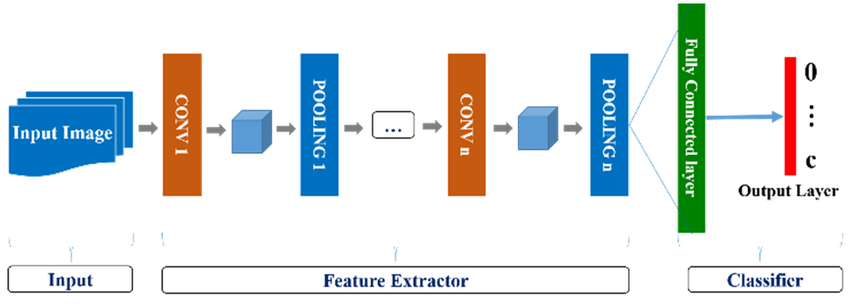
   
  

---

## 🚀 Results

### Segmentation Results
| Model | IOU (Test) | Dice | Accuracy |
|-------|------------|------|----------|
| **FCN** | 94.08 | 76.05 | 95.22% |
| **U-Net** | 94.87 | 88.57 | 94.88% |

  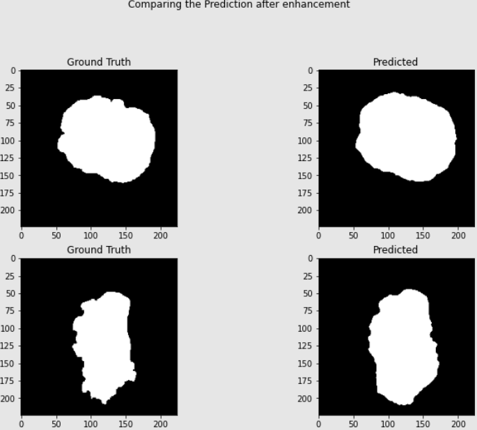
  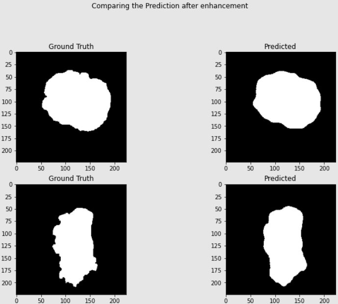

  

Training curves:  

  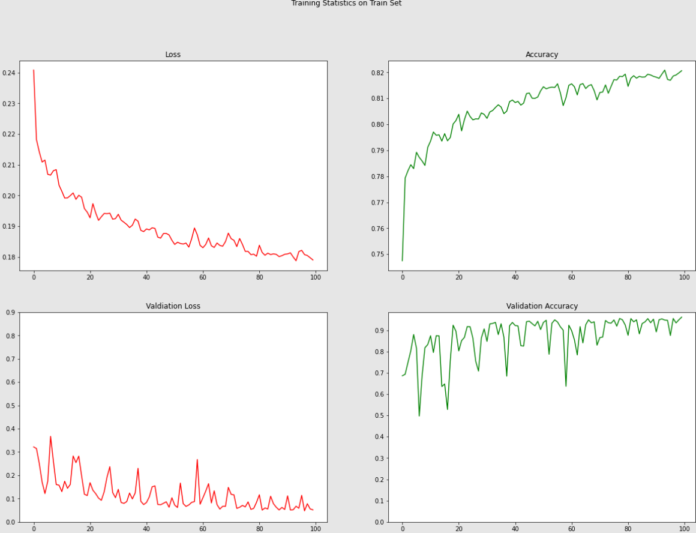
  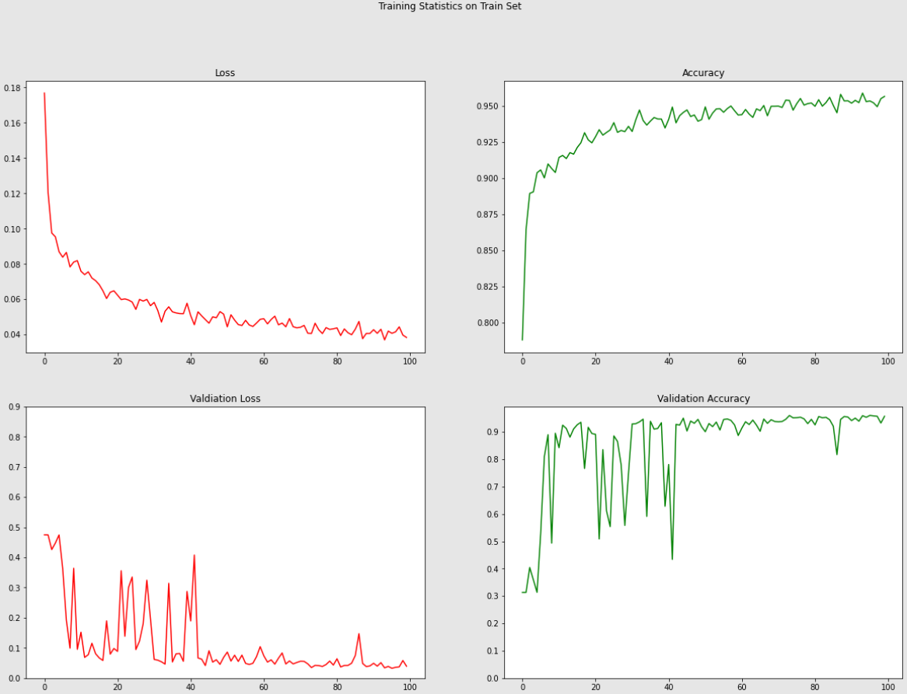

  

---

### Classification Results
7-class skin lesion classification using CNN:  

  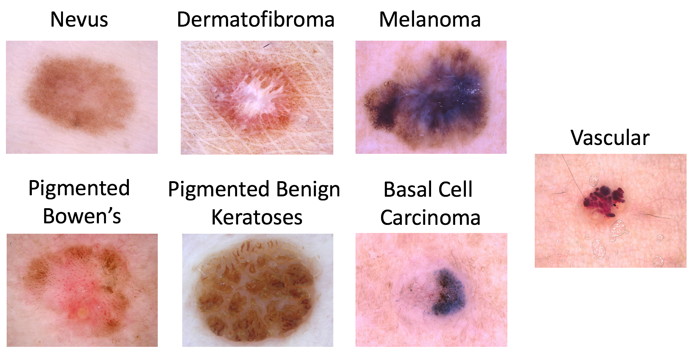
  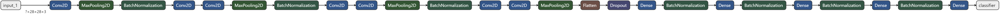

  

Training performance:  

  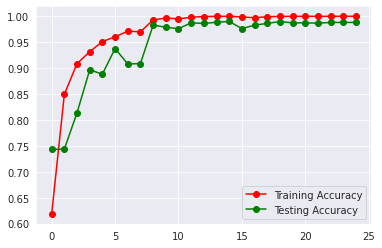
  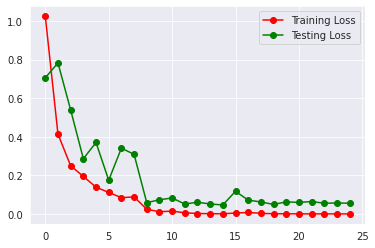

  

---

## 🛠️ Tech Stack
- Python, TensorFlow / Keras  
- Jupyter Notebooks  
- GPU Training + Fine-Tuning  

---

## 🌟 Key Takeaway
This project demonstrates **end-to-end medical image analysis**, with **segmentation + classification pipelines** trained and fine-tuned for dermatology applications.  

---
